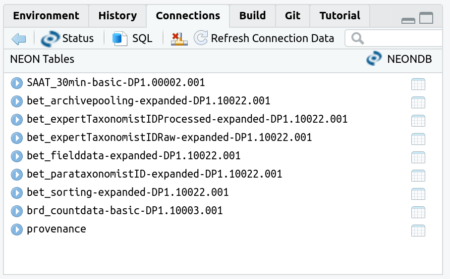

<!-- README.md is generated from README.Rmd. Please edit that file -->

```{r, setup, include = FALSE}
knitr::opts_chunk$set(
  collapse = TRUE,
  comment = "#>",
  out.width = "100%",
  cache = FALSE
)
library(neonstore)
Sys.setenv("NEONSTORE_HOME" = "store")
```

The National Ecological Observatory Network (NEON) represents an important resource and a major investment in data collection infrastructure needed to address many of the grand challenges facing environmental science [@NAS_NEON; @Balch2020; @Nagy2021].
NEON provides access to 181 (active and planned) ecological data products at 81 (permanent and relocatable) sites throughout the United States.
The `neonstore` R package seeks to provide provenance aware, high performance access and persistent storage of NEON data files. 
Here, we describe the design, use, and rationale for the package.
We illustrate a few example use cases, including downloading the 30 minute single-aspirated temperature data across all available NEON sites and dates, a collection of over 13 thousand individual files totalling nearly 2 gigabytes of data.
We demonstrate how `neonstore` facilitates summary calculations such as computing monthly means across all sites in a fraction of a second with minimal memory requirements.
The approaches taken in `neonstore` maximize reproducibility, facilitate collaboration including across computer languages, and help making analyses which leverage the full spatial and temporal scale of NEON easily available to researchers with modest computational resources and expertise. 


# Rationale and package design

Provenance and performance are two central aspects to the design of `neonstore`.
A focus on provenance means that analyses can always be traced back to individual NEON data files, and supports both workflows that require access to the most recent or updated data and workflows that require repeated access to persistent, stable data files.
A focus on performance reflects the potentially very large size of its aggregated data products, which can easily exceed available working memory (RAM) on most machines: as many unified tables of even single products over all available sites and dates can range from 10 GBs into the terrabyte range. 
Because enabling analyses that could span the full spatial and temporal range of NEON's 81 sites over a 30 year horizon is a foundational motivation for NEON research, it essential that researchers be able to easily work with data across this full span. 
However, doing so requires techniques that go beyond workflows which expect data to be re-downloaded (provenance) or stored in memory for analysis (performance).

To address these challenges, `neonstore` implements a high-performance, provenance aware workflow by drawing on a host of key technologies, including cryptographic hashes, a Lightning Memory Mapped Database (LMDB) for metadata management, a columnar-oriented integrated relational database (duckdb) for data management, and optional support for remote access through parquet files cloud-native object stores to facilitate sharing large databases generated by `neonstore`. 
These technologies are seamlessly integrated behind a user-friendly R interface which requires no expertise in the underlying backend technology beyond a familiarity with R and the "tidy data" model used in the popular R packages, `dplyr` and `tidyr`.


## Provenance

`neonstore` focus on provenance emphasizes being able to trace results back precisely to individual raw data files provided by the NEON API.
NEON data products are distributed using a highly atomized file design: with each data product from either both observation systems (OS) and instrument systems (IS) divided into separate files by site and month.
Products generated by the airborne observation platform (AOP) are typically divided by type, flight date, flight line, and grid cell.
This atomized approach facilitates sub-setting and data transfer, because users can identify ahead of time which products, locations, and time ranges they need.
As some NEON data products can be quite large (NEON's complete data catalog to date is already in excess of 1 petabyte, primarily due to the size of many AOP products), being able to download or read only the files of interest is already important to save bandwidth or computer memory, or disk space.
This approach also facilitates data provenance and reproducibility, because it means that an update or correction to data collected at a particular site and time results only in a change to a single file and not the whole data product.
However, the highly atomized structure of NEON's data can also become a barrier to entry.
Most analyses will inevitably require multiple files to be combined or stacked, e.g. to create a unified record for a product across many months or years of sampling or across many sites. `neonstore` provides functions to stack data products that have been atomized into separate files by month, site or sensor position into single `data.frame` objects, store stacked tables in a local, high-performance database, and track individual data rows back to their raw data files.

Managing provenance of NEON data means dealing with the addition of new data, corrections published to old data, and changes to file names that do not represent changes in underlying data.
Any analysis is only as good as as the data supporting it.
Because NEON data is subject to both revisions (where previously released data are corrected) and new releases (where more recently collected data is made public), researchers will seek to update previous analyses with corrected data and new observations.
`neonstore` enables scripted workflows through which such updates can occur automatically by re-running the same script.
More confusingly, NEON frequently updates the timestamp associated with a file even when the file has not changed.
Typically these events are associated with the update of a separate but related file. In such cases, `neonstore` can avoid downloading and importing these unchanged data, ensuring that automated workflows do not run unnecessarily.
When new or revised data significantly alter results, it is also important to be able to pinpoint precisely what has changed and why.
These elements creates five distinct tasks for managing NEON data provenance:
(1) The ability to determine which of each of the individual raw data files were used in an analysis 
(2) The ability to append new data as it is collected and released 
(3) the ability to transparently replace existing data when corrections are published, 
(4) the ability to avoid re-downloading or re-stacking data that has been previously processed, 
(5) the ability to freeze the data used in a given analysis, so that results can reliably be repeated without accidentally including revised or newer data products.

To provide these five abilities for data provenance, `neonstore` maintains a local file store containing all raw data files downloaded from NEON.
Additionally, each file is entered into a local registry, along with the file's MD5 checksum (CRC32 for AOP products) and currently associated NEON release (if any).
This local registry is kept in a Lightning Memory Mapped Database, LMDB, an extremely fast, open source key-value store indexed on both file name and checksum.
MD5 checksums effectively indicate unique content.
It is theoretically possible for a malicious actor to create a file with different contents but the same checksum, but vanishingly unlikely to occur by chance.
On requesting new files to download, `neonstore` compares file names and hashes reported by the API to those in the local store, allowing it to omit any data that has already been downloaded, even if the timestamp in a file name has changed but the contents remain the same. 

NEON's filenaming convention provided essential metadata about each file, such as the data product (product level, product number, revision number), site, year and month of the release, file description, a timestamp.
Sensor data (IS) also include additional information about the horizontal and vertical position and meaasurement interval (frequency) of the sensor product.
AOP products use a somewhat different convention with flight information.
`neonstore` recognizes all published NEON file naming conventions and automatically parses NEON filenames into their component parts.
Data are organized into subdirectories based on product, site, and year-month respectively.
Data or metadata files shared across all months or all sites of a product are stored in the corresponding parent directory.
The function `neon_index()` returns a `data.frame` listing every recognized individual file in the local store, along with the corresponding metadata fields parsed from the filename.
Optional arguments can be given to restrict this table to files matching specific products, sites, date ranges, etc.

## Performance

`neonstore` is also concerned with performance of research workflows based on NEON data.
Native operations in R are based in memory, making it difficult to work with objects that are larger than RAM.
Researchers seeking to take full advantage of NEON data collected across all available sites and years can quickly run ub against the limits of data which can be held and processed in working memory.
The R language also supports interfaces with relational databases [@dbi], with the widely used package `dplyr` capable of seamlessly tanslating common functions (e.g. `filter`, `select`, `mutate`, `group_by`, `summarise`, `inner_join`, etc) into SQL queries that can be run by external database servers [@dplyr; @dbplyr].
This allows users to perform common tasks on data much larger than would fit into working RAM.
Traditional relational databases such as MariaDB and Postgres use a server-client model with row-oriented data structures, suitable for concurrent read and write operations by many simultaneous client processes acccessing a central database (e.g. many client banks simultaneously updating a central registry of accounts, see ACID).
Modern data science workflows frequently benefit more from column-oriented data structures where simultaneous operations (ACID transactions) are not required.
This makes it possible to both eliminate the requirement of separately installing and running a database server while also opening the door to substantial performance improvements beyond the reach of traditional relational database clients.
`duckdb` is a leading example of such a columnar database [@Raasveldt_2019; @duckdb], with seamless support for R integration and superior performance benchmarks to both traditional relational databases and in-memory operations in R using `dplyr`. 

`neonstore` allows users to easily import tabular NEON data products (including `.h5` based eddy covariance products) into a local `duckdb` database using the function `neon_store()`.
If desired, users can instead use their own existing databases by providing the appropriate `DBI::dbConnection` object to the `db` argument of `neon_store()`. `neon_store()` stacks corresponding individual raw tabular data files by month, site, and (for IS data) sensor position into individual database tables.
`neon_store()` is capable of detecting revisions to previously released data products, removing outdated rows and replacing them with updated rows without accidental duplication of data.
Data revisions are indicated by downloading files which share the same data product, site, month and sensor position file name as files already present in the local store, but have an updated timestamp and differing content hash.
`neon_store()` provides a warning whenever existing data tables are updated, as this may require previous analyses to be re-run.
Because sensor data does not indicate the site or position information in individual data files (this is provided only through the file name) `neonstore` stacking functions add additional columns for these variables automatically.
Additionally, a `file` column is always included indicating the raw file source for each row.
Many NEON data products come in two types: a "basic" format and an "expanded" format which may include additional columns providing data fields that were not included in the original product specification.
NEON does not always use globally unique names for table descriptions, particularly for metadata tables such as `sensor_positions`. To avoid ambiguities created by these issues, database table names are formed using the table description name, the product type, and the product number, e.g. `brd_countdata-basic-DP1.10003.001`, rather than the description component alone, `brd_countdata`.
RStudio users can bring up an interactive list of available tables in the RStudio "Connections" pane using the function `neon_pane()` [Fig #1].


 

<!--

Box 1: Provenance workflow
- Existing NEON data used in an analysis to support a result.
- A data file is corrected for an error. Revised data file is downloaded, imported into `neonstore` database, replacing deprecated data. Deprecated data file is retained in local file store for future reference.
Analysis confirms same result
- Next month's data are released, downloaded, imported by `neonstore`, and then used to revise model and provide updated result

-->

`neonstore` seeks to help users download and manage NEON files locally in a way that lets analyses be quickly traced back to the raw data files.
`neonstore` is distinguished as much by what it does not do as by what it does.
All `neonstore` operations are intended to be transparent and intuitive, and could easily be duplicated in another computational language or command line interface.
Specifically, `neonstore` will never automatically "clean" data: opaque data transformations make output sensitive to the version and implementation details of the tool in question.
A user should expect the same file from a "download" operation regardless of the software or software version used to perform the download.
Functions which in read in the data should faithfully reproduce the raw data so that analyses can easily be compared to those using other software tools.
When functions perform tasks like guessing the data type (numeric, string, Date, etc) of a column, or adding additional columns to stack two otherwise matching tables in which one has recorded an additional variable, they should do so in a manner that is transparent, controllable, and consistent with the behaviour of common functions used in the language. 


## `neonstore` Functionality


`neonstore` functionality can be divided into two halves: functions that interface with the NEON Application Programming Interface (API), and functions for working with a local store of previously-downloaded NEON files.


```{r}
library(neonstore)
library(dplyr)
```

### A local store for neon files

The location of the local store can be configured depending on the context.
The default behavior is to rely on a user-specific location appropriate for the operating system, e.g. `~/.local/share/R/neonstore` on Linux, `C:\Users\<username>\AppData\Local\R\neonstore` on Windows, or `~/Library/Application Support/R/neonstore` on Mac OS X, as determined by `tools::R_user_dir()` which provides appropriate modern defaults [see @rappdirs].
This approach works well for a single user setup such as a laptop, where a user can share the store across multiple projects in different directories.
On a server system that is accessed by multiple users, a shared location that permits all users to read and write files to the store may be preferable.
Because `neonstore` only writes raw NEON data to the store, there is no risk of overwriting work of other users, while the shared storage can reduce consumption of redundant download and storage.
In yet other cases, a user may prefer a path that is specific to a single project. 

It is of course possible to use a temporary directory such as `tempdir()` for the storage location.
Such an approach is the default download location of the alternative package, `neonUtilities`, although this can be configured there as well.
However, doing so defeats the purpose of having a persistent store, which allows us to both preserve the original raw data files between R sessions.
Because new NEON data files are released regularly, this approach allows us to easily download only the new files.
This contrasts to the typical workflow in `neonUtilities`, in which a user discards the individually downloaded files and is left to their own devices on how to keep store the resulting stacked data in order to avoid re-downloading each time.

The best way to set the file directory of the store is to declare the path using the environmental variable, `NEONSTORE_HOME`, for example, using a `.Renviron` file in the user or system home directory.
For one-off use, all functions that access the store take an optional argument `dir` to specify the directory location, (which defaults to `neon_dir()`, a function that either uses the value set by `NEONSTORE_HOME` or the `rappdirs` location if unset).
However, using the environmental variable instead results in more portable code, by allowing other users to set their own storage locations independently instead of hard-wiring it into the R code.

The local `neonstore` database is written in the same user and OS specific location by default, but is configured using a separate environmental variable, `NEONSTORE_DB`, or optional argument to appropriate functions,  `db_dir`.
Because simultaneous write-access is not supported by the default high-performance database engine, `duckdb`, in multi-user environments it may be advantageous to share a location for raw data files by setting `NEONSTORE_HOME` while allowing users to create individual local databases in their home directories by leaving `NEONSTORE_DB` unset.
Alternately, users can share a database as well by setting `NEONSTORE_DB` to a shared location, and adopting workflows which do ensure multiple users do not simultaneously call `neon_store()` to update the database.


### NEON API functions

`neon_products()` and `neon_sites()` bind the NEON REpresentational State Transfer (REST) API endpoints for `/products` and `/sites`, providing information about each as a data frame. This can be useful for product discovery and occassionally for referencing other useful metadata about products and sites.
Each of these functions requires only a single API call (see discussion of rate limiting below).

```{r}
products <- neon_products()
products
```

```{r}
sites <- neon_sites()
sites
```

One of the most important functions of `neonstore` is `neon_download()`, which downloads all files identified by a given product code, optionally constrained to specific site, date range, or file name pattern.
For instance, we can download all of the NEON landbird survey data, identified as NEON data product `DP1.10003.001`: 
(The three-digit code identifies this as a Level 1 data product (DP1), product number 10003, revision 001, indicating this is the first and so far the only protocol used for bird survey sampling). 

```{r}
neon_download("DP1.10003.001")
```

To download this data, `neon_download()` must make many API calls.
It first uses `neon_sites()` to reference all sites containing this data product.
Then for each site, for each month for which that site collected data, the function will make an API call to the `/data` endpoint (using the `neonstore` function, `neon_data()`), which returns a table of files found for that product at the requested site and month range.
The  table from `neon_data()` indicates 4 values: the file name, the MD5 or CRC32 hash of the data file (CRC32 hashes are used only for AOP data products), the file size (in bytes -- encoded as a character because some file sizes are too long to be represented as an integer), and a download URL.
The download URL embeds a temporary access token which expires after an hour, so users must complete all the downloads before this time expires.
The access string for each file is unique, thus it is (at the time of writing) impossible to download any given data file without making a corresponding API request, even if the precise file name and address is already known.
For the most part, this issue is invisible to `neonstore` users, as `neon_download()` calls automatically pass all download URLs to the download step. 

`neon_download()` handles the following tasks:


- `neonstore` aims to provide persistent storage, writing raw data files to
  the appropriate app directory for your operating system (see `rappdirs`,
  [Ratnakumar et al 2016](https://CRAN.R-project.org/package=rappdirs)), now provided by the base R function `tools::R_user_dir()`.
  Files are organized into appropriate subdirectories by product, site, and year-month of sampling.
- `neon_download()` provides  clean and concise progress bars for the two key
  processes involved: querying the API to obtain download URLs (which involves no 
  large data transfer but counts against API rate limiting, see below), and the
  actual file downloads.
- `neon_download()` will verify the integrity of file downloads against the MD5 or CRC32
  hashes provided. 
- `neon_download()` will omit downloads of any existing data files in the local 
  store (even if the timestamp portion of the filename has changed without updating the file)
- You can request multiple products at once using vector notation, though API
  rate limiting may interfere with large requests.
- `neon_download()` uses `curl::curl_download()` instead of `downloadr` package
  used in `neonUtilities`, which can be finicky on Windows and older versions of R. 
- Automatic handling NEON's rate limiting policy.
  To do this, `neon_download()` must  pause 100 seconds every 150 requests if an API token is not supplied or every 950 requests if a token is available.
  Should a rate-limit error be detected, (possible if the same token is used in parallel requests), `neon_download()` will also pause for 100 seconds before retrying the failed request.
  Requests and pauses are communicated through the user messaging interface.
- Expanding compressed HDF5 files (`*h5.gz`).
  (Note: unusually, NEON chooses to compress binary h5 files with gzip, even though gzip compression is built internally into the H5 specification at configurable compression levels.
  NEON does not choose to compress text-based formats such as .csv, where compression has larger gains.
  Compression has implications for version management, where `neonstore` must track the hashes of compressed files to avoid duplicate downloads)
- Updating the local manifest in LMDB with the individual checksum and current release tag for each downloaded object (see Provenance)


Note that if we immediately attempt to re-download a subset of this data, `neonstore` detects that we have precisely matching files already downloaded to our local store:

```{r}
neon_download("DP1.10003.001", 
               start_date = "2018-01-01", 
               end_date = "2019-01-01",
               site = "YELL")
```

## Interacting with downloaded files


Even adding a handful of products can generate thousands or hundreds of thousands of files in a local store.
Surprisingly, these can even exceed the capacity of common `bash` shell utilities like `ls`.
`neonstore` sidesteps this issue through a convenient R-based interface.
The function `neon_index()` will list all recognized files found in the local store as a `data.frame`.
`neon_index()` uses a sophisticated filename parser, `neon_parse_filenames()`, that understands all documented file naming conventions listed at <https://data.neonscience.org/file-naming-conventions>, and quite a few that are not yet listed (internal NEON communication).
The most common of these are displayed in the table:

```{r}
neon_index()
```

Note that the index also contains important provenance information, including the checksum (MD5 or CRC32), timestamp, and release tag indicated by NEON.
Internally, `neonstore` uses checksums to track the provenance of all files downloaded, which allows it to handle both the cases when NEON changes the name of a file but not the contents, and when NEON changes the contents of a file, even if the name remains unchanged. 
`neon_index()` takes optional arguments such as `product`, `start_date`, `end_date`, and `site` to allow for convenient sub-setting.


**Stacking datasets**

The highly atomized file structure breaks tables down by site and year/month as individual csv files (and other formats, including h5).
Typical workflows will treat a collection of such files as a single data table, with columns indicating the site, year, and month of sampling.
When combining the collection of files into a single table (a process sometimes known as stacking), `neonstore` must handle several special cases:

1) Not all files have identical columns in identical order across all sites and months. This can break simple, high-performance file readers like `vroom` and `arrow`.
2) The data types of columns (string, numeric, date, timestamp, etc) must be inferred correctly. 
   This can be difficult when certain columns within individual files have no non-missing (`NA`) values.
3) Additional columns must be added to capture information (metadata) that is only available in the file name, such as siteID and position (for sensor-based products).
4) Most importantly, reading must be provenance-aware -- if there are two files with matching product, table, site, year-month and position (for sensor-based products) must resolve which file should be read in based on the timestamp provided, or the requested version.

`neonstore`'s stacking functions handle all of this for us.
When a version of the same data is detected with a revised timestamp compared to an earlier download, `neonstore` will notify us of the detection, but default to reading the most recent available version.

`neonstore` provides two alternative mechanisms for stacking data.
The simplest approach is `neon_read()`, which stacks all matching files into a single, in-memory `data.frame`.
Note that `neon_read()` can be given arguments to filter by site, date range, etc to read in a particular selection of data more quickly.
`neon_read()` always reads directly from the original, raw data files downloaded to the local neonstore.

```{r}
brd_countdata <- neon_read("brd_countdata-expanded")
```

For very large tables such as sensor data collections spanning many sites and years, users will require the increased performance provided by the high-performance, columnar-oriented relational database, `duckdb` [@Raasveldt_2019; @duckdb].
To take advantage of this approach, we must first store the contents of the individual data files in the relational database using the function `neon_store()`:

```{r}
neon_store("brd_countdata")
```

This task needs to be done only once for each table or product after any new files have been downloaded.
Thanks to provenance tracking, any repeated calls to this function will not result in additional imports.
If a previously imported file has been deprecated by the publication of a matching file with newer timestamp,
`neon_store()` will remove the deprecated data and import the new data, with a warning saying so.

Once data has been imported into the local database, we can quickly load the table into R with `neon_table()`

```{r}
brd_countdata <- neon_table("brd_countdata")
```

This will be somewhat faster than `neon_read()`, since there is no need to parse the original data.
By default, this will still read all the data into a normal in-memory `data.frame` in R.
When working with very large data tables, it may be preferable or necessary to work with data
directly in duckdb, which can perform most `dplyr` and `tidyr` operations, such as `group_by()`, `summarise`, 
`filter`, and so forth, within the database. 

**Working with very large data products**


```{r}
brd_countdata <- neon_table("brd_countdata", lazy = TRUE)
brd_countdata
```

Note that R displays what appears to be the same data frame as before, but with two essential differences.
R indicates that the displayed object is a `duckdb_connection`, and lists the number of rows only as `??`
(or within RStudio's rmarkdown interface, only the first 1000 rows will be displayed in the interactive table).
The number of rows is not displayed because this query is executed "lazily." Since the print method needs only
display the first 6 rows, the database does not execute the potentially expensive operation of counting all the rows
in the table, it merely displays the first 6. 
This approach is particularly pwoerful if we wish to first subset or summarise the data in a way that will result
in an overall smaller table.

Consider the example of a much larger table collected by sensor data; say, single-aspirated temperature collected every 30 mintues across all sites:
Note that we exploit pattern matching to provide a short-hand to the table name.
We download and import the 30m sampled table. 
The initial download is not a fast operation - in our example, rate-limiting rules by NEON make the command take over 20 minutes to complete the API requests that would otherwise take only 3 minutes.
The download itself is determined more by network speed. 
In our example this takes about 1 hour to download over 13 thousand individual files.
Because NEON uses download links that expire after 1 hour, it may be necessary to repeat the download command after more than an hour expires,
(alternatively, divide the download into multiple batches by years or sites).
The `neon_download()` utility can pick up from where it left off.

`neon_store()` import is also a slow, one-time operation to read in all of these files into the database, depending on disk and precessor speeds. 
In our example, this takes about 20 minutes.
Note that it is not necessary to repeat these commands later except to import newly released data, which will be added to the persistent store.

```{r download_temp}
neon_download(product = "DP1.00002.001", table = "30min") #Temp single aspirated
neon_store(product = "DP1.00002.001", table = "30min") #Temp single aspirated
```

With the data imported into the database, `neon_table()` can quickly connect to the remote database.

```{r}
temp <- neon_table(product = "DP1.00002.001",  table = "30min", lazy=TRUE) #Temp single aspirated
```

This is a lot of data! Over 19 million rows:

```{r}
temp %>% count()
```

However, working with the remote duckdb connection, we can compute summary statistics, such as monthly averages for each site, takes only milliseconds:

```{r}
bench::mark({
temp_monthly <- temp %>%
  mutate(month = month(startDateTime)) %>%
  group_by(siteID, month) %>%
  summarise(mean_temp = mean(tempSingleMean, na.rm=TRUE),
            max = max(tempSingleMean, na.rm=TRUE),
            min = min(tempSingleMean, na.rm=TRUE),
            .groups = "drop") %>% 
  collect()
})
```
Not only is this about 10x faster than if we had read the table entirely into R first, but this also executes with minimal memory footprint (317Kb) instead of the over 2.6 GB required to perform the same operation in R.
Having summarized the data using our desired statistics, the `collect()` command has returned the result as a regular in-memory `data.frame` which we can use with other R functions, such as data visualization tools: 


```{r}
library(ggplot2)
library(lubridate)
temp_monthly %>% mutate(month = lubridate::month(month, label=TRUE)) %>%
  filter(siteID %in% c("HARV", "ORNL")) %>%
  ggplot(aes(month, mean_temp, col=siteID, ymin = min, ymax = max, fill = siteID)) +
  geom_linerange(lwd=4, alpha=.5) +
  geom_point(size=8, shape="_")
```

Similarly, it is straight forward to use most other `dplyr` operations, such as the joins, to combine data across multiple tables.
The promise of NEON is precisely this ability to work across a large spatial and temporal range of data collected in standardized fashion.


```{r include=FALSE}
temp %>% select(verticalPosition, horizontalPosition) %>% distinct()

index <- neon_index(product = "DP1.00002.001", table = "30min") 
info <- index$path %>% fs::file_info()
n_files <- length(index$path)
n_bytes <- sum(info$size)
```

**Network-based access**.

In R, we refer to the `duckdb` database as a "remote" connection because the operations are handled outside of R, by `duckdb`.
Some database connections, like MySQL or Postgres, require the user to install a separate piece of software, often on an external server,
which we then access over the network connection (with appropriate security credentials), though it can also be run on the same local machine as the 'client' software.
This client-server approach can be very powerful, but requires more knowledge and resources to deploy.
In contrast, `duckdb` installs automatically as a stand-alone R package.


As illustrated above, the slowest part of the process by far are the one-time steps of initial download of over 10,000 individual files, and the importing of those files into the database.
Further, the storage requirements for users working with NEON data spanning many products, sites, and dates can be restrictive. 
As such, it may be desirable for a research team working on such an analysis to establish a single shared `neonstore` storage center rather than expect that all users will download, import, and maintain their own local stores.
To facilitate this process, `neonstore` supports access to remote network-based storage over cloud-native storage protocols with the help of  Apache `arrow` [@arrow].
First, using `neonstore`, we download and import the data as above.
Our next step is export this database to a parquet snapshot using `neon_export_db()` and upload that data to cloud native storage system such as Amazon Web Services (AWS) S3 bucket, or, in our case, a self-hosted MINIO [@minio] instance. 
This is much cheaper and raises less security concerns than maintaining a server, as the remote service is providing only networked storage, not general-purpose computing power.


We pass the connection details to `neon_remote_db`.
In this case, we use a public (read-only) bucket, though other users may prefer to configure access that requires a secret key.


```{r include=FALSE}
Sys.unsetenv("AWS_DEFAULT_REGION")
Sys.unsetenv("AWS_S3_ENDPOINT")
Sys.unsetenv("AWS_ACCESS_KEY_ID")
Sys.unsetenv("AWS_SECRET_ACCESS_KEY")
Sys.setenv("AWS_EC2_METADATA_DISABLED"="TRUE")
```


```{r}
con <- neon_remote_db(host = "minio.thelio.carlboettiger.info",
                      bucket = "shared-data",
                      path = "neonstoredb")
```


Once a connection to the remote database is established, we can request individual tables using `neon_remote` to access the data using dplyr functions.
Like `neon_table()`, we must use `collect()` to draw the data into R if we wish to perform advanced R-specific operations that are not supported by the backend engine.

```{r}
remote_temp <- neon_remote("30min", product = "DP1.00002.001", db = con)
remote_temp %>% count(siteID) %>% collect()
```

Because this approach relies on operations over a network connection, it will generally be bandwidth limited unless the bucket is located in the same region as compute operations (e.g. in a regional cloud server).
Users may also download the `parquet` exported files directly and import them into a local `neonstore` instance (see `neon_import_db()`) to share neonstore snapshots without requiring independent downloads.
Using `neon_db_export()` to generate snapshots is also a reliable way to preserve and version your analyses for future that does not depend on access to the NEON API or even to `neonstore`.
This approach should work equally well for data exchange with collaborators not using R.
`parquet` is a widely used data interchange format with support in most major languages, including python, Java and C++.
Similarly, `duckdb` is a cross-platform tool that can be accessed not only from R, but from python, Java, and many other languages, including web assembly (for running in the browser) or run using a stand-alone CLI [@duckdb].


## Dependencies and optional dependencies

`neonstore`'s core dependencies are quite light, avoiding hard requirements on other packages which themselves bring in a large recursive list of dependencies. `DBI` [@dbi], `duckdb` [@duckdb], and `thor` [@thor] provide the core database interfaces; all have no recursive dependencies.
`httr` [@httr] provides functionality required to interface with the NEON REST API, and `R.utils`, `zip`, and `vroom` [@vroom] provide parsers required to unpack the data.
`progress` provides user-friendly progress bars and estimated run-times for slow functions.
Optional dependencies are required for specific tasks. `dplyr` is needed for lazy read in `neon_table()`.
`neonUtilities` [@neonUtilities] and `rhdf5` are required at this time for reading in eddy-covariance products.
`arrow` [@arrow] is required for remote database connections using `neon_remote()`.
`rstudioapi` is required to utilize `neon_pane()` to view the connections pane from within RStudio.
The remaining suggested dependencies are utilized within testing only.

## Conclusions

`neonstore` provides a high-performance and provenance-aware mechanism for accessing, maintaining, and working with NEON data products, designed to scale seamlessly to analyses which stretch across the full spatial and temporal range which makes this nation-wide dataset so uniquely valuable. 
The `neonstore` package follows simple and robust best-practices for data management that can work across most popular computing languages; such as preserving a local library of the original raw data files downloaded from NEON, and importing data into a local relational database (`duckdb`) that can be accessed from a wide range of libraries.
Additional utilities enable serverless network-based sharing of a large `neonstore` database across a team through the use of `parquet` and `arrow`'s remote filesystems (which likewise supports most major computing languages.)
`neonstore` has been co-developed by NEON staff (CL & CL) and members of the Ecological Forecasting Initiative (CB & RQT), tested in supporting the EFI NEON forecasting challenge [@efi_challenge], among other use cases. 


# References
